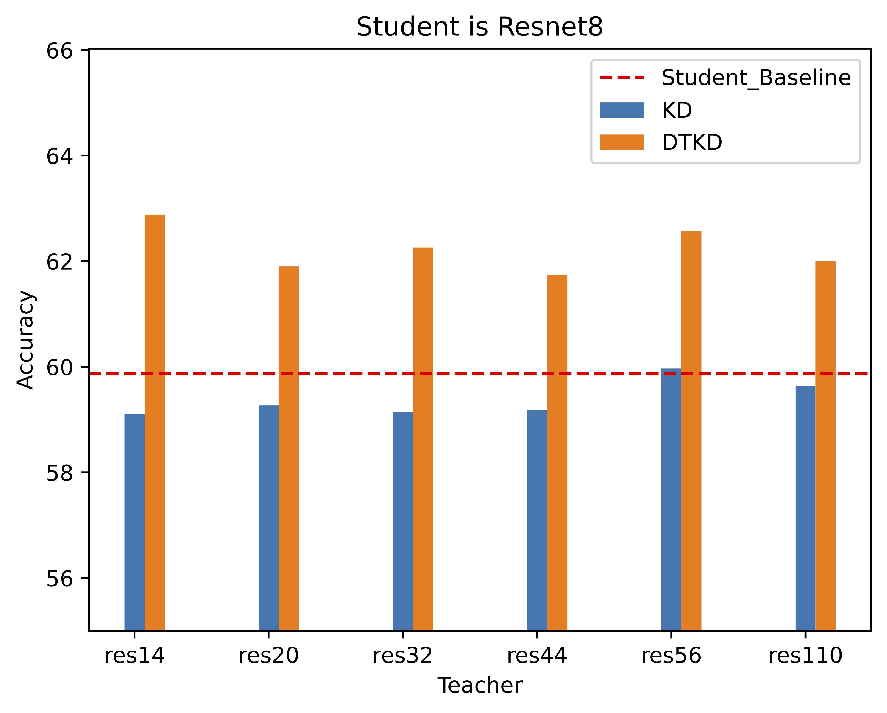
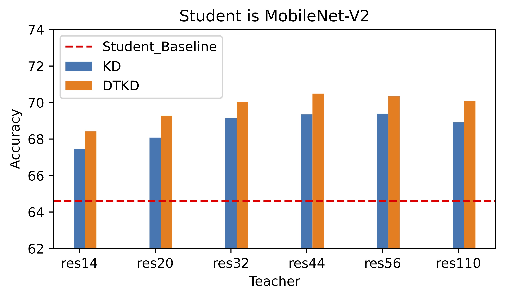

# Dynamic Temperature Knowledge Distillation

> 代码正在持续更新中, 如果有任何的问题, 欢迎提ISSUE或者联系我~

The paper link is <https://arxiv.org/abs/2404.12711>

The code is built on [mdistiller](<https://github.com/megvii-research/mdistiller>).

## Framework & Performance

### Different teachers distilled into `ResNet8`
<div style="text-align:center"></div>

### Differernt teacher distilled into `MobileNetV2`
<div style="text-align:center"></div>

## TODO
- [ ] To update the code that records the temperature in training.
- [ ] To update the analysis code.
- [ ] Release other network models. (Such as ResNetXXX)

## Installation

Environments:

- Python 3.8
- PyTorch 1.7.0

Install the package:

```
sudo pip3 install -r requirements.txt
sudo python3 setup.py develop
```

For more details please refer to <https://github.com/megvii-research/mdistiller>

## CIFAR-100

- Download the `cifar_teachers.tar` at <https://github.com/megvii-research/mdistiller/releases/tag/checkpoints> and untar it to `./download_ckpts` via `tar xvf cifar_teachers.tar`.

  ```bash
  python3 tools/train_ours.py --cfg configs/cifar100/dtkd/res32x4_res8x4.yaml 
  ```

# Acknowledgement
- Sincere gratitude to the contributors of mdistiller for your distinguished efforts.

# Contact

YuKang Wei: weiyukang1998@163.com